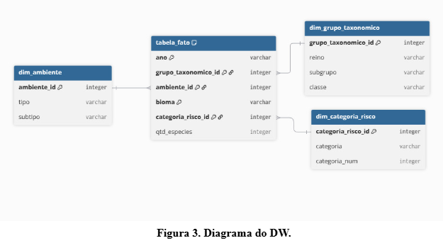

## **Projeto Data Warehouse: Contas de Espécies Ameaçadas**

Este repositório contém o desenvolvimento de um protótipo de Data Warehouse (DW) focado na análise da fauna e flora brasileiras em perigo de extinção. O projeto foi desenvolvido no ambiente **Databricks**, utilizando **PySpark**, **Pandas** e **Delta Lake**.

### **Integrantes**:
  
* Ana Clara Santana Matta
* Gabriel Araujo Streicher

## 🎯**Objetivo**
O objetivo é analisar dados sobre a fauna e a flora brasileiras em relação ao perigo de extinção; fornecendo uma base consolidada de informações que podem apoiar gestores ambientais e pesquisadores no entendimento da situação ambiental brasileira e apoiar a formulação de políticas de conservação do meio ambiente. O DW permite responder perguntas cruciais sobre a biodiversidade, como a distribuição de risco por bioma, grupo taxonômico e evolução temporal.

## 📚 **Fonte de dados**
Os dados foram extraídos via API do IBGE (Instituto Brasileiro de Geografia e Estatística), especificamente da pesquisa "Contas de Espécies Ameaçadas".

## ⚙️ **Arquitetura e Pipeline de Dados (ETL)**

  

O projeto segue a arquitetura Medallion (Bronze, Silver, Gold) dentro do Databricks:
1. Camada Bronze (Extração): Extração dos dados brutos da API do IBGE em formato JSON e conversão para DataFrame.
2. Camada Prata (Transformação): Limpeza, remoções de redundâncias, criação de hierarquias e análise exploratória.
3. Cama Ouro (Modelagem Dimensional): Construção do Modelo Estrela para fins analíticos.

No fim de cada camada, os dados são salvos como uma Tabela Delta no diretório: `/Volumes/workspace/public/volume/delta/`

  

